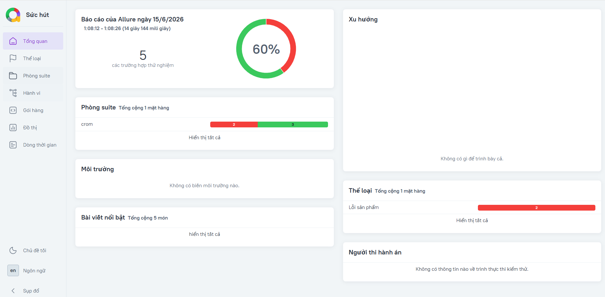
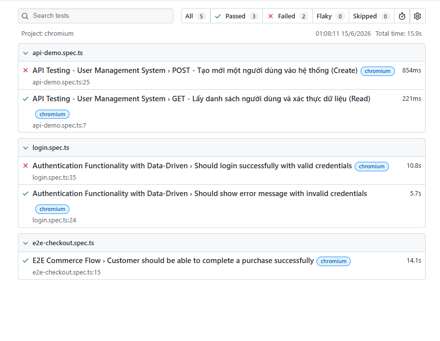

# 🛒 Automation Test Framework - SauceDemo

Đây là project cá nhân mình setup để chạy test tự động (End-to-End) cho trang web bán hàng [SauceDemo](https://www.saucedemo.com/)

Mục tiêu của repo này là build một framework test gọn gàng, chuẩn công nghiệp, mô phỏng lại luồng mua hàng thực tế của user từ lúc login đến khi thanh toán xong, đồng thời áp dụng các kỹ thuật thiết kế code của một QA chuyên nghiệp

## 📊 Kết Quả Kiểm Thử (Test Reports)

Dự án có khả năng xuất đa dạng các loại báo cáo để phục vụ cho các cấp quản lý khác nhau:

**1. Báo cáo tổng quan cho Manager (Allure Dashboard):**


**2. Báo cáo chi tiết cho Developer/QA (Playwright HTML):**


## 🛠 Tech Stack & Kỹ Thuật Áp Dụng
* **Core:** Playwright
* **Language:** TypeScript
* **Design Pattern:** Page Object Model (POM) - Giúp tách biệt phần giao diện (UI) và logic test, dễ bảo trì khi web thay đổi
* **Data-Driven Testing (DDT):** Bóc tách hoàn toàn dữ liệu test (Test Data) khỏi mã nguồn, hút dữ liệu tự động từ file JSON

## 📂 Cấu trúc Project
* `pages/`: Chứa các class định nghĩa Locator và Action của từng trang (VD: `LoginPage.ts`, `InventoryPage.ts`)
* `tests/`: Chứa các file kịch bản test thực tế
* `fixtures/`: Chứa các file `users.json` lưu trữ tài khoản test
* `docs/`: Chứa hình ảnh báo cáo (Test Reports)
* `playwright.config.ts`: File config chung của hệ thống

## 🚀 Hướng dẫn setup & chạy ở máy (Local)

**1. Clone repo & cài thư viện:**
```bash
git clone [https://github.com/NguyenKhoe053/Luma-Automation-Project.git](https://github.com/NguyenKhoe053/Luma-Automation-Project.git)
cd Luma-Automation-Project
npm install
npx playwright install
